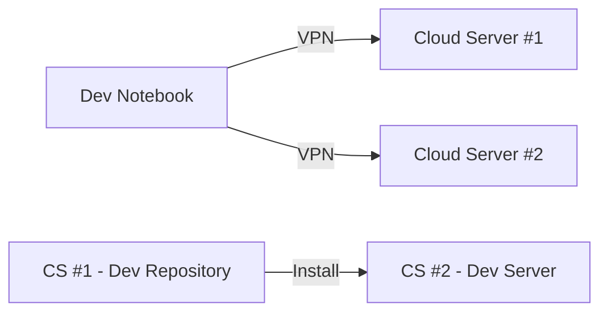
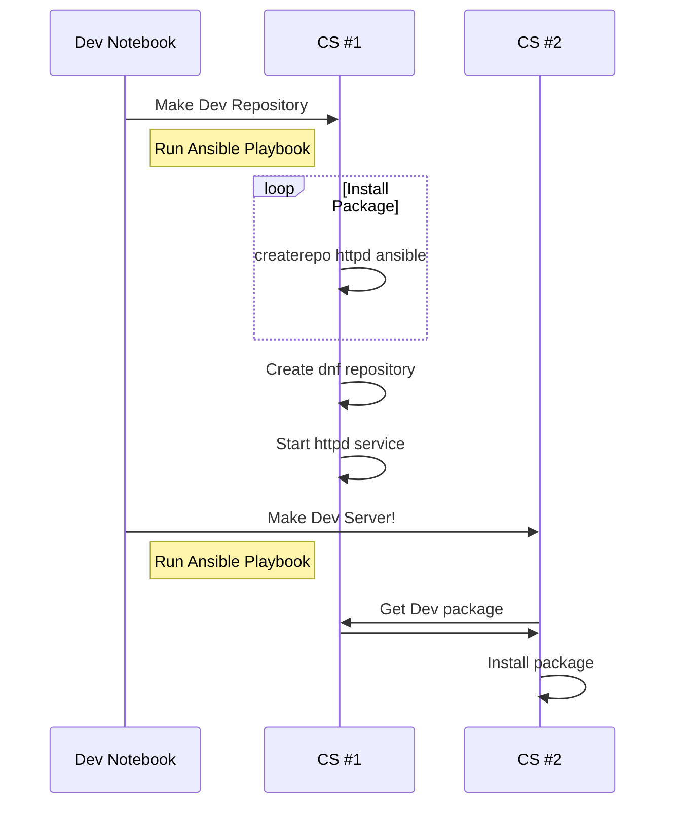

# 폐쇄망 개발환경 구축 테스트
## 구성도


## Sequence Diagram


## 가상 서버 구축
  - vagrant : 개발 환경을 가상화하고 자동화하여 일관된 작업 환경을 제공하는 도구
     - [install](https://developer.hashicorp.com/vagrant/install)
  - 가상서버 생성(Power shell)
     - vagrant up : Vagrantfile 을 활용하여 서버 생성
  ```
  c:\> cd "git clone directory"\vagrant\DevSvr1
  C:\"git clone directory"\vagrant\DevSvr1> vagrant up

  c:\> cd "clone directory"\vagrant\DevSvr2
  C:\"git clone directory"\vagrant\DevSvr2> vagrant up

  c:\> cd "git clone directory"\vagrant\DevSvr3
  C:\"git clone directory"\vagrant\DevSvr3> vagrant up
  ```

  - vagrant ssh remote 접속 설정(기본은 접속 안됨!!)
  ```
  C:\"git clone directory"\vagrant\DevSvr1> vagrant ssh

  $ sudo vi /etc/ssh/ssh_config
       PasswordAuthentication yes // 주석삭제 후 저장
  $ sudo systemctl restart sshd
  ```
## Ansible
  - IT 환경의 설정 관리, 애플리케이션 배포 등을 자동화하는 오픈 소스 도구로, 코드형 인프라(IaC)에 활용함
  
### Install
```
$ sudo dnf -y install epel-release
$ sudo dnf update
$ sudo dnf -y install ansible
$ ansible --version
```

### Ansible 접속 설정 (DevSvr1)
  - ssh key 생성(서버에 패스워드 없이 접속을 위해 사용)
     - vagrant ssh or mobaxterm 등 활용해서 접속
     - id/password : vagrant/vagrant
  ```
  $ ssh-keygen -t rsa -b 4096 -C "your_email@example.com"
     enter enter enter
  $ ssh-copy-id vagrant@192.168.33.12
  $ ssh-copy-id vagrant@192.168.33.13
  ```

### Run Ansible playbook (DevSvr1)
  - DevSvr2 에 dnf local repository 만들기
  ```
  $ cd "git clone directory"
  $ ansible-playbook -i inventory setup_dnfrepo.yml
  PLAY [...] *************

  TASK *******************

  PLAY RECAP *************
  ```

  - DevSvr3 에 ansible Package 설치
  ```
  $ ansible-playbook -i inventory setup_ansible.yml
  PLAY [...] *************

  TASK *******************

  PLAY RECAP *************
  ```

### 구축 확인
  - dnf local repository (DevSvr1 ~ DevSvr3)
  ```
  $ curl http://192.168.33.12/dnfrepo
  or
  Web Browser 
  ```

  - ansible package (DevSvr3)
  ```
  $ ansible --version
  ansible [core 2.14.14]
  config file = /etc/ansible/ansible.cfg
  configured module search path = ['/home/vagrant/.ansible/plugins/modules', '/usr/share/ansible/plugins/modules']
  ansible python module location = /usr/lib/python3.9/site-packages/ansible
  ansible collection location = /home/vagrant/.ansible/collections:/usr/share/ansible/collections
  executable location = /usr/bin/ansible
  python version = 3.9.18 (main, Jan 24 2024, 00:00:00) [GCC 11.4.1 20231218 (Red Hat 11.4.1-3)] (/usr/bin/python3)
  jinja version = 3.1.2
  libyaml = True
  ```